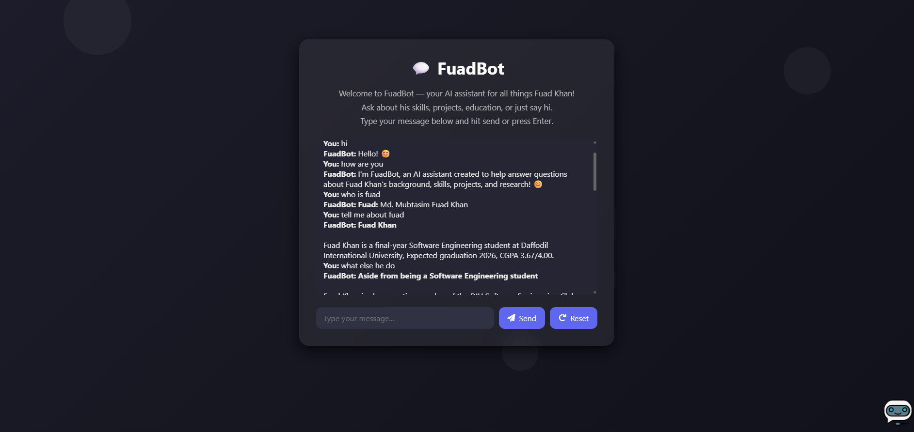

# 🤖 FuadBot — AI Chatbot Powered by LLaMA 3 (Groq)

[🚀 Live Demo](https://fuadbot-ui.vercel.app/)

FuadBot is a Gen-Z-style AI chatbot built by **Fuad Khan**, a Software Engineering student at Daffodil International University. It runs on **LLaMA 3 (Groq)** and is designed to answer short, focused, and fast — like a true digital twin 🔥

---

## 🖼️ Screenshot



> 💡 Tip: You can replace this with your actual screenshot URL from your project or GitHub repo!

---

## 🧠 Features

- ⚡ Powered by **LLaMA 3** via **Groq API**
- ✨ Speaks like a chill Gen-Z dev
- 📩 Replies are short, focused, and friendly
- 🧼 Chat reset support
- 💬 Markdown rendering (bold, italic, list, line breaks)
- ☁️ Hosted frontend on **Vercel**, backend on **Render**

---

## 🛠️ Tech Stack

### Frontend
- HTML, CSS, JavaScript
- Markdown-to-HTML parsing
- Hosted on [Vercel](https://vercel.com)

### Backend
- Node.js + Express
- Groq API integration
- Hosted on [Render](https://render.com)

---

## 🌐 Live Links

| Part        | URL |
|-------------|-----|
| 🧩 Frontend | [https://fuadbot-ui.vercel.app](https://fuadbot-ui.vercel.app) |
| 🔧 Backend API | [https://fuadbot-api.onrender.com/chat](https://fuadbot-api.onrender.com/chat) |

---

## 📁 Repositories

| Name         | Link |
|--------------|------|
| 🖼️ Frontend Repo | [github.com/Fuad-Khan/fuadbot-ui](https://github.com/Fuad-Khan/fuadbot-ui) |
| ⚙️ Backend Repo  | [github.com/Fuad-Khan/fuadbot-api](https://github.com/Fuad-Khan/fuadbot-api) |

---

## 🚀 Local Setup

### 🔹 Frontend

```bash
git clone https://github.com/Fuad-Khan/fuadbot-ui.git
cd fuadbot-ui
# Open index.html in your browser
