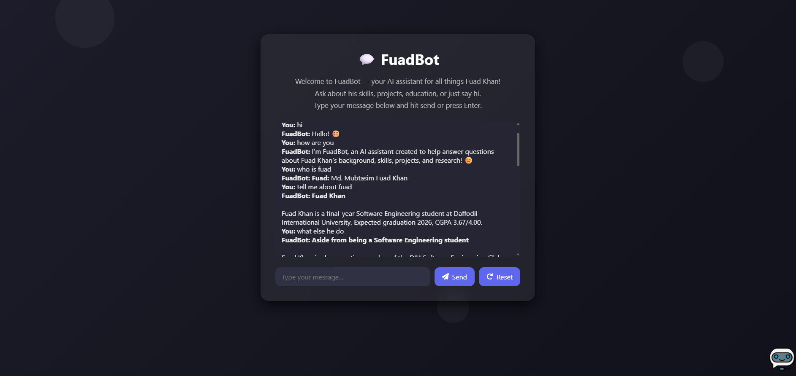

# 🤖 FuadBot — AI Chatbot Powered by LLaMA 3 (Groq)

[🚀 Live Demo](https://fuadbot-ui.vercel.app/)

FuadBot is a Gen-Z-style AI chatbot built by **Fuad Khan**, a Software Engineering student at Daffodil International University. It runs on **LLaMA 3 (Groq)** and is designed to answer short, focused, and fast — like a true digital twin 🔥

---

## 🖼️ Screenshot



---

## 🧠 Features

- ⚡ Powered by **LLaMA 3** via **Groq API**
- ✨ Speaks like a chill Gen-Z dev
- 📩 Replies are short, focused, and friendly
- 🧼 Chat reset support
- 💬 Markdown-style formatting support (bold, italic, lists, line breaks)
- ☁️ Frontend on **Vercel**, backend on **Render** (FastAPI)

---

## 🛠️ Tech Stack

### Frontend
- HTML, CSS, JavaScript
- Simple fetch-based API calls
- Hosted on [Vercel](https://vercel.com)

### Backend
- **Python 3 + FastAPI + Uvicorn**
- Groq API (LLaMA 3 `llama3-8b-8192`)
- Hosted on [Render](https://render.com)
- `/chat` endpoint that accepts `{ "message": "..." }` and returns `{ "reply": "..." }`

---

## 🌐 Live Links

| Part           | URL |
|----------------|-----|
| 🧩 Frontend    | https://fuadbot-ui.vercel.app |
| 🔧 Backend API | https://fuadbot-api.onrender.com/chat |

---

## 📁 Repositories

| Name              | Link |
|-------------------|------|
| 🖼️ Frontend Repo  | https://github.com/Fuad-Khan/fuadbot-ui |
| ⚙️ Backend Repo   | https://github.com/Fuad-Khan/fuadbot-api |

---

## 🚀 Local Setup (Frontend Only)

You can run the frontend locally as a static site and still call the deployed backend.

```bash
git clone https://github.com/Fuad-Khan/fuadbot-ui.git
cd fuadbot-ui
````

Then either:

* Open `frontend/index.html` directly in your browser, **or**
* Use a simple static server (recommended):

### Using Python (3.x)

```bash
cd frontend
python -m http.server 5500
```

Now open:

```text
http://localhost:5500/index.html
```

---

## 🔗 Configuring the API Endpoint

In `frontend/chatbot.js`, make sure the API URL points to your backend:

```js
const API_URL = "https://fuadbot-api.onrender.com/chat";
```

If you run a backend locally (FastAPI), you can temporarily change it to:

```js
const API_URL = "http://localhost:5000/chat";
```

---

## 💡 How It Works (High Level)

1. User types a message in the chat box.
2. Frontend sends a `POST` request to the backend `/chat` endpoint:

   ```json
   {
     "message": "Your message here"
   }
   ```
3. Backend (FastAPI + Groq) sends the prompt + system instructions to LLaMA 3.
4. Backend returns:

   ```json
   {
     "reply": "AI response here"
   }
   ```
5. Frontend renders the response in the chat UI.


